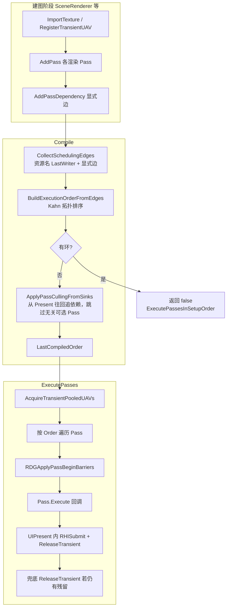
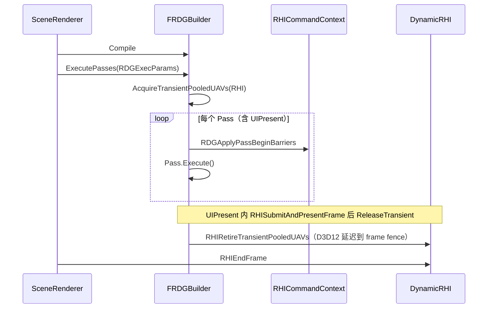

# FRDG：编译与执行流程

本文描述 `Engine::FRDGBuilder` 如何登记 Pass、推导调度边与编译执行顺序。与资源/屏障细节见 [RDG-RHI-Resource-And-Barriers.md](RDG-RHI-Resource-And-Barriers.md)。Mermaid 图用 `Ctrl+Shift+V` 预览。

---

## 1. 角色

| 组件 | 作用 |
|------|------|
| `FRDGBuilder` | 单帧内的 Pass 图：登记、编译、执行 |
| `ImportTexture` | 外部纹理（如 `FSceneTextures` 池化 RT），图不拥有寿命 |
| `RegisterTransientUAV` | 帧内瞬态 UAV（D3D12 可走 aliasing 堆） |
| `AddPass` / `AddPassDependency` | Pass 本体与无共享纹理名的显式依赖 |
| `Compile` | 建边 → 拓扑排序 → 可选裁剪与 Present 无关的可选 Pass |
| `ExecutePasses` | 按 `LastCompiledOrder` 顺序执行，Pass 前自动 barrier |

---

## 2. 编译与执行总览

---

## 3. 调度边如何产生

### 3.1 资源名流（自动）

对每个 Pass 的 `Inputs` / `Outputs` 中的 `FRDGPassResource::Name`：

1. 维护 `LastWriter[资源名] = Pass 索引`
2. Pass 读取某名且存在 writer → 加边 `writer → 当前 Pass`
3. Pass 写入某名 → 更新 `LastWriter`

典型链：`SceneColor` 由 `ClearSceneTextures` 写出 → `RenderBasePass` 读写 → `DeferredLighting` → `Tonemapping` …

### 3.2 显式边 `AddPassDependency`

用于**没有共享 RDG 纹理名**的依赖，例如：

- 阴影贴图生成 → BasePass / DeferredLighting
- `BuildGpuLightLists` → 前向 / Fur
- `Tonemapping` → `ShadowDebugWire` → `UIPresent`

---

## 4. 无用可选 Pass 裁剪

`FRDGCompileParameters::bPassCullingFromSinks`（默认 `true`）在拓扑排序通过后执行：

1. **终点**：带 `RDG_GraphSink` 的 Pass（主场景为 `UIPresent`）——帧图里必须走到的出口。
2. **往回追**：沿调度边从终点往上游走（谁在给 Present 喂数据？再往谁追？），得到「最终会影响上屏」的 Pass 集合。
3. **只裁允许裁的**：Pass 须同时满足 `RDG_MayCullIfUnreachableFromSink`，且**不在**上述集合里，才不进入 `LastCompiledOrder`（本帧不执行）。
4. **终点不裁**；未打 `MayCull` 的 Pass 一律保留。

一句话：**从 Present 沿依赖往回找，链外、且标记为可跳过的可选 Pass 本帧不跑。**

---

## 5. 执行期行为

要点：

- `RDGBarrierCommandContext` 与 Pass 录制使用**同一** `RHICommandContext`
- `RDGAcquirePooledResourcesRHI` 必须非空，否则 Bloom 等 `RegisterTransientUAV` 不会分配
- 瞬态 UAV 在 **`UIPresent` 的 `RHISubmitAndPresentFrame` 之后** 才 `ReleaseTransient`（命令列表已 `Close`）
