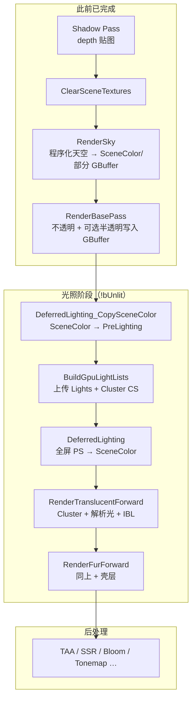
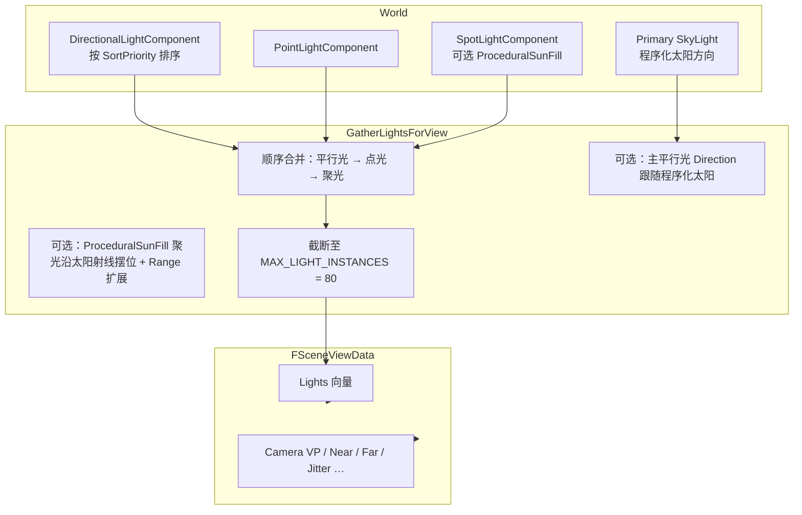
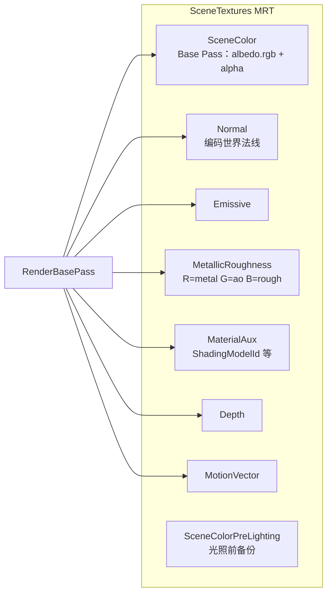
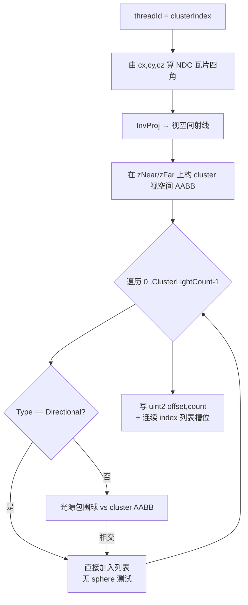
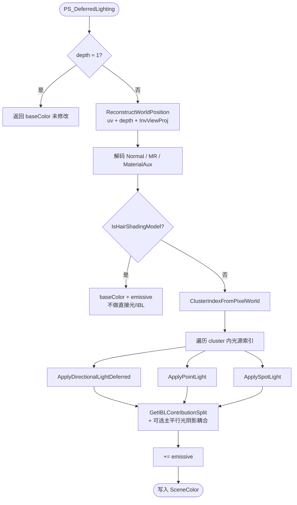
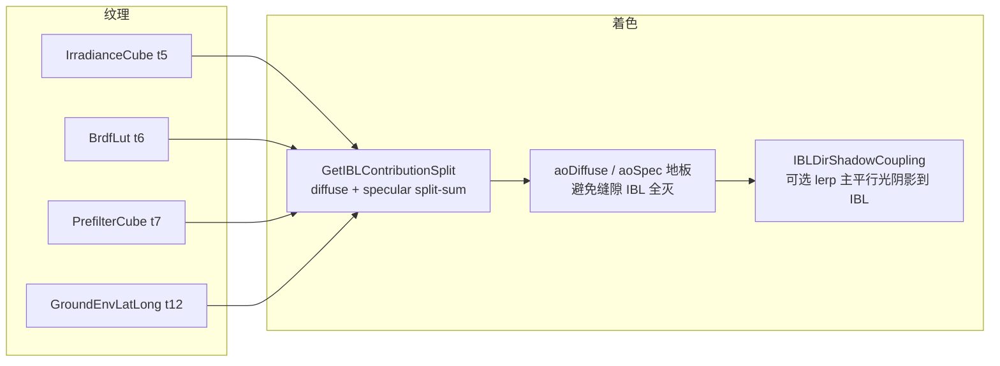
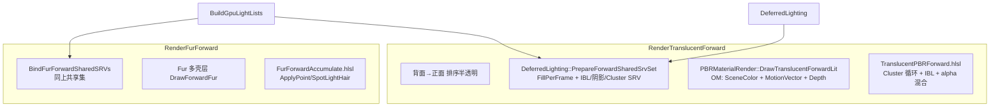
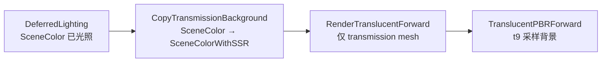
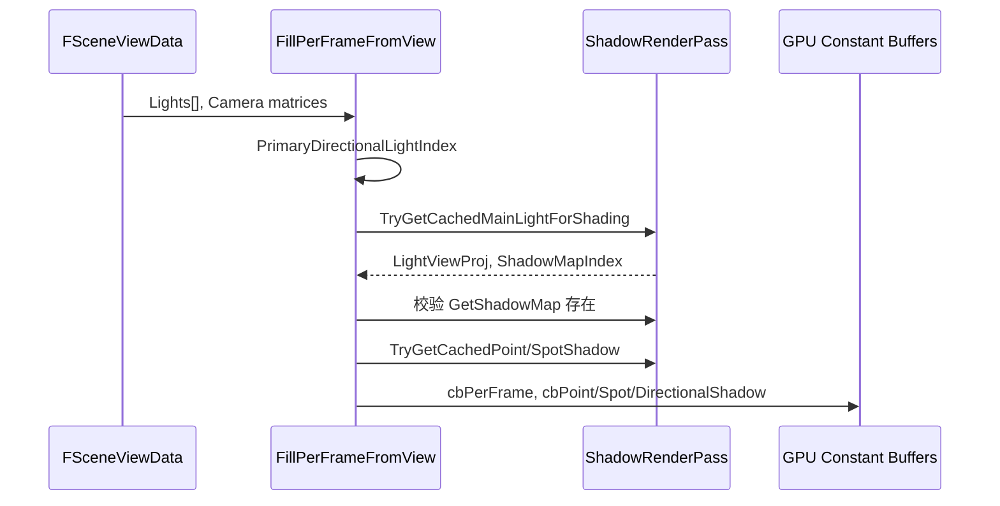
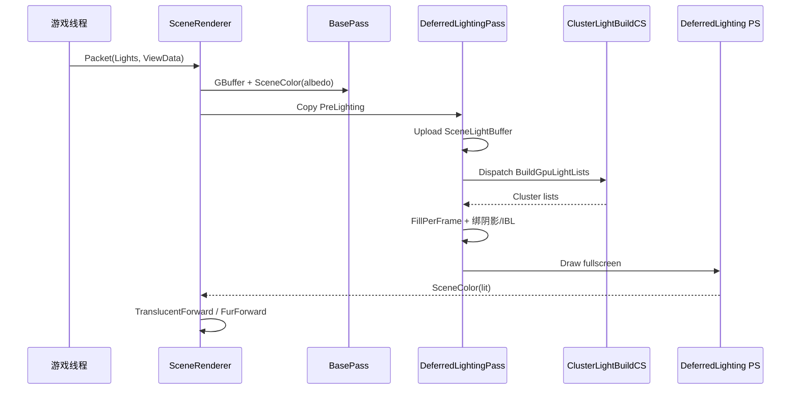

# MiniEngine 光照渲染流程说明

本文描述 **延迟路径（GBuffer + 全屏 DeferredLighting）** 与 **Clustered Forward+（半透明 / Fur）** 如何收集光源、构建 GPU 光列表、计算直接光与 IBL。阴影 depth 生成见 [`Shadow-Rendering.md`](Shadow-Rendering.md)；帧级 Pass 顺序见 [`SceneRenderer-Frame-Graph.md`](SceneRenderer-Frame-Graph.md)。

---

## 1. 相关源码

| 模块 | 路径 |
|------|------|
| 光源收集 | `Engine/Src/Engine/Scene/World.cpp` → `GatherLightsForView` |
| 视图数据 | `Engine/Src/Engine/Render/SceneRendering/SceneViewData.cpp` |
| 渲染包 | `Engine/Src/Engine/Render/WorldSceneRender.cpp` → `FSceneRenderPacket` |
| RDG 调度 | `Engine/Src/Engine/Render/SceneRendering/SceneRenderer.cpp` |
| 光照 Pass | `Engine/Src/Engine/Render/SceneRendering/DeferredLightingPass.cpp` |
| RDG 资源边 | `Engine/Src/Engine/Render/SceneRendering/RDGDeferredLightingPass.cpp` |
| Base Pass | `Engine/Src/Engine/Render/SceneRendering/DeferredShadingBasePassRenderer.cpp` |
| Cluster CS | `Render/ShaderLibDX/ClusterLightBuildCS.hlsl` |
| Cluster 查找 | `Render/ShaderLibDX/ClusterLightLookup.hlsl` |
| 全屏延迟 PS | `Render/ShaderLibDX/DeferredLighting.hlsl` |
| 解析光 BRDF | `Render/ShaderLibDX/DeferredLightingAnalytic.hlsl` |
| IBL / 点光立方体 PCF | `Render/ShaderLibDX/DeferredLightingShared.hlsl` |
| 半透明前向 | `Render/ShaderLibDX/TranslucentPBRForward.hlsl` |
| Fur 前向 | `Render/ShaderLibDX/FurForwardAccumulate.hlsl` |
| 常量 / Light 结构 | `Engine/Engine/Render/MaterialPreFrame.h` |

---

## 2. 光照在帧管线中的位置



**启用条件**：`DeferredLighting` 已初始化、`SceneTextures` 有效、`!ViewData->bUnlit`。  
**RDG 依赖**：`BuildGpuLightLists` → `DeferredLighting` / `RenderTranslucentForward` / `RenderFurForward`。

---

## 3. 游戏线程：光源如何进入视图



`WorldSceneRender` 提交帧时：

- `Packet.ViewFamily.PrimaryView().Lights` ← `GatherLightsForView()` 快照  
- `Packet.LightsForShadow` ← 带 `ShadowMapIndex` 的副本（供 Shadow Pass，见阴影文档）

### 3.1 阴影槽位策略（与光照 CB 一致）

| `ShadowMapIndex` | 含义 | 阴影贴图 |
|------------------|------|----------|
| `-1` | 无阴影 | — |
| `0` | 主平行光 | `DirectionalShadow` 2D（可 CSM Atlas） |
| `2` | 点光立方体 | `PointShadowCube`（每帧**首个**开启阴影的点光） |
| `3` | 聚光 | `SpotShadow` 2D（每帧**首个**开启阴影的聚光） |

**解析光**：最多 80 盏仍进入 `Lights[]` / Cluster 列表；仅带槽位的光源在 `Apply*Light` 中走 PCSS/立方体/聚光采样。

**主平行光索引**：`PrimaryDirectionalLightIndex` = `Lights[]` 中**第一个** `LightType_Directional`（与 `GatherLights` 排序一致）。

---

## 4. GBuffer 与 Base Pass（光照输入）



**延迟光照读取**（`PS_DeferredLighting`）：

| 寄存器 | 绑定（C++） | 内容 |
|--------|-------------|------|
| t0 | `SceneColorPreLighting` | Base Pass 输出的 **未光照** baseColor（Copy 后） |
| t1 | Normal | 世界法线 |
| t2 | Emissive | 自发光 |
| t3 | MetallicRoughness | PBR 参数 |
| t4 | Depth | 重建 `worldPos` |
| t9 | MaterialAux | Shading Model；**Hair** 在此 pass **跳过**（仅前向 Fur 受光） |

天空 `RenderSky` 在 Base Pass 之前可向 SceneColor 等写入程序化背景（与 IBL 立方体来源不同）。

---

## 5. 光照三阶段总览（C++）

```mermaid
flowchart TB
  subgraph p1 ["① CopySceneColorToPreLighting"]
    C1[RHICopyResource<br/>PreLighting ← SceneColor]
  end

  subgraph p2 ["② DispatchClusterLightCulling"]
    U1[SceneLightBuffer.Update<br/>最多 256 盏 Light 结构]
    U2[cbClusterBuild ← ViewMatrix / InvProj / Near / Far]
    CS[ClusterLightBuildCS<br/>6912 clusters × 64 lights/cluster]
    OUT[ClusterLightOffsetCount + IndexList UAV→SRV]
  end

  subgraph p3 ["③ ExecuteRaster"]
    FILL[FillPerFrameFromView<br/>cbPerFrame + Point/Spot/Dir Shadow CB]
    BIND[绑定 GBuffer + IBL + 阴影 + Cluster SRV]
    DRAW[全屏三角形 Draw(3)<br/>RTV = SceneColor]
  end

  p1 --> p2 --> p3
```

**D3D11 注意**：Cluster CS 在 `SF_Compute` 槽 0 绑定 `SceneLightBuffer`；进入全屏 PS 前必须 `RHISetShaderStructuredBuffer(SF_Compute, 0, nullptr)`，否则与 PS 的 t13 冲突。

---

## 6. Cluster 光列表构建（BuildGpuLightLists）

### 6.1 网格划分

| 轴 | 尺寸 | 说明 |
|----|------|------|
| X | 24 | 屏幕宽度均分 |
| Y | 12 | 屏幕高度均分 |
| Z | 24 | 视空间深度 **对数切片** `[Near, Far]` |
| **总数** | **6912** | `24×12×24` |
| 每 Cluster 最多光源 | **64** | 溢出则截断 |

与 `Engine::ClusterLightCulling::*` / HLSL `CLUSTER_GRID_*` **必须同步**。

### 6.2 Cluster CS 单线程逻辑



- **平行光**：影响所有 cluster（列表可能很大，受 `MAX_LIGHTS_PER_CLUSTER` 限制）。  
- **点/聚光**：世界空间位置 + `Range`（聚光另用锥体近似）做相交测试。  
- **无原子**：每个 cluster 独占 `IndexList` 中的一段（`offset = clusterIndex * MAX_LIGHTS_PER_CLUSTER`）。

### 6.3 Dispatch 参数

- **线程组**：`64×1×1`，组数 `ceil(6912 / 64) = 108`  
- **输入 SRV**：`SceneLightBuffer`（与上传的 `ViewData->Lights` 一致）  
- **输出 UAV**：`_ClusterLightOffsetCount`（`uint2`：起始偏移 + 数量）、`_ClusterLightIndexList`

同一 `ViewData` 指针帧内 **幂等**（半透明 + Fur 共享，不重复 dispatch）。

---

## 7. 全屏延迟光照 PS（DeferredLighting）

### 7.1 像素主流程



### 7.2 解析光（`DeferredLightingAnalytic.hlsl`）

| 类型 | BRDF | 阴影 |
|------|------|------|
| 平行光 | `GetPointShade(Direction, …)` GGX | `ShadowMapIndex≥0` → `DirectionalShadowVisibility`（PCSS + CSM） |
| 点光 | 距离衰减 × GGX | 仅 `ShadowMapIndex==2` 且 `PointShadowEnabled` 且 `lightIndex==PointShadowLightIndex` → 立方体 PCF |
| 聚光 | 距离 × 锥体衰减 × GGX | 仅 `ShadowMapIndex==3` 且 `SpotShadowEnabled` 且 index 匹配 → `SampleSpotShadowVisibility` |

### 7.3 IBL（`DeferredLightingShared.hlsl`）



来源：`USkyLightComponent` 烘焙的 Diffuse/Specular Cube + BRDF LUT；`FillPerFrameFromView` 设置 `IBLFactor`、`IBLDirShadowCoupling` 等。

### 7.4 关键 PS 资源绑定（与 C++ 一致）

| 槽位 | 资源 |
|------|------|
| t0–t4 | PreLighting, Normal, Emissive, MR, Depth |
| t5–t7, t12 | IBL Cube / LUT / Ground LatLong |
| t8 | 平行光 `ShadowMap`（比较深度） |
| t10 | `PointShadowCube` |
| t11 | `SpotShadow` |
| t13–t15 | `SceneLights`, `ClusterLightOffsetCount`, `ClusterLightIndexList` |
| b0 | `cbPerFrame` |
| b4–b5, b7 | `cbPointShadow`, `cbSpotShadow`, `cbDirectionalShadow` |
| s0–s2 | 线性 / 阴影 / 比较采样器 |

---

## 8. Cluster 索引：延迟 vs 前向

```mermaid
flowchart TB
  subgraph deferred ["全屏延迟"]
    W[worldPos + pixelXY] --> VZ[viewZ = CameraWorldToView.z]
    VZ --> IDX1[ClusterIndexFromPixel<br/>pseudoSv.w = 1/viewZ]
  end

  subgraph forward ["半透明 / Fur / Transmission"]
    SV[pixelPos SV_Position] --> IDX2[ClusterIndexFromPixel]
  end

  IDX1 --> LOOKUP[_ClusterLightOffsetCount[idx]]
  IDX2 --> LOOKUP
  LOOKUP --> LIST[循环 IndexList<br/>延迟: myPerFrame.Lights[li]<br/>前向: _SceneLights[i]]
```

前向与延迟使用 **同一套** Offset/Index 缓冲；延迟因全屏三角形 `SV_Position.w` 不是几何 clip W，必须用 `ClusterIndexFromPixelWorld`。

---

## 9. 前向半透明与 Fur



- **共享 SRV**：`FFurForwardSharedSrvSet`（IBL、三阴影、SceneLights、Cluster 缓冲）与延迟 raster 对齐。  
- **半透明**：在已光照的 `SceneColor` 上 **alpha 混合** 追加直接光 + IBL。  
- **Fur**：Deferred 跳过 Hair SM；在此 pass 用壳层法线 + 简化高光路径。

### 9.1 KHR_materials_transmission（屏空间透射）

实现范围：`KHR_materials_transmission` + `KHR_materials_volume` + `KHR_materials_ior` + `KHR_materials_dispersion`（屏空间折射采样；色散为三通道 IOR 偏移合成）。

**材质加载（`GltfMaterial.cpp`）**

| glTF | 引擎行为 |
|------|----------|
| `transmissionFactor > 0` | `UsesTransmissionShading()`、`IsTransparent()` |
| `KHR_materials_volume` | `AttenuationColor/Distance`、`ThicknessFactor`、厚度贴图 **G 通道** → t4 |
| `KHR_materials_ior` | `MaterialIor`（默认 1.5）→ 折射背景 UV |
| `KHR_materials_dispersion` | `MaterialDispersion`（0 = 关）→ cbPerMaterial |
| 无 baseColor 贴图 | 默认 `(1,1,1,1)`；**不用** `attenuationColor` 作 baseColor |
| 无 occlusion 贴图 | AO 默认 **1.0**（非 0.5） |

**Pass 调度**



1. **跳过 BasePass 半透明**：`UsesTransmissionShading()` 的 mesh 不写 GBuffer 半透明 MRT（避免与 forward 冲突）。
2. **独立 RDG Pass `CopyTransmissionBackground`**（`DeferredLighting` 与 `RenderTranslucentForward` 之间）：**仅当** `FSceneRenderPacket::bSceneHasTransmissionMesh` 为真时登记，执行 `CopySceneColorForTransmissionBackground`：
   - `RHICmdListUnbindAllRenderTargets`（D3D12：延迟光照后 SceneColor 仍可能绑为 RTV，直接 Copy 会 hazard）
   - `RHICopyResource(SceneColorWithSSR, SceneColor)`
   - 将 `SceneColorWithSSR` 转为 SRV
3. **`PBRMaterialRender::DrawTranslucentForwardLit`**（在 `RenderTranslucentForward` 的单一 OM scope 内逐 mesh 调用）：透射材质绑 **t9** `BackgroundSceneColor`；`BlendDisable` 全量替换像素；velocity 写 0；`InvScreenResolution` 经 `MaterialRenderParam` 传入 forward pass。

**着色（`TranslucentPBRForward.hlsl`）**

| 项 | 说明 |
|----|------|
| 背景 UV | 世界空间折射出口 NDC + **视空间 parallax** 偏移；`BackgroundSceneColor.Sample(SampleLinear, uv)` 双线性；UV clamp 到屏幕边缘 |
| 色散 | `MaterialDispersion > 0` 时对 R/G/B 分别用 `ior ± spread` 采样，合成 `outRgb[i] = samp[i]` |
| 体积衰减 | Beer–Lambert；`distance = length(refractRay)`，含 `modelScale` |
| IOR / F0 | `KHR_materials_ior` → split-sum `EnvironmentBRDF` + BRDF LUT |
| 合成 | `lerp(outgoingDiffuse, (1-F)*bg*baseColor*volumeAtt, T) + directSpec + iblSpec + emiss`（镜面保留完整 direct + IBL） |
| 旋转 UI 残影 | forward 绘制时对透射 mesh 令 `PrevModelMatrix = CurrModelMatrix` |

**参考场景 JSON**：`GLTFModel/dragon_dispersion.json` — IBL `HDR/spruit_sunrise_2k.hdr`、`IBLIntensity` 1.0、方向光 `LightStrength` 2.5；含 **`RoamCamera`**（与 `harley.json` 同参数：WASD / Space·Ctrl / 右键视角 / 滚轮缩放）；**勿**启用 `GroundIBLHdr`。

---

## 10. FillPerFrameFromView 与阴影 CB 衔接



- 无 shadow RT 时强制 `ShadowMapIndex = -1`，避免 PS 采样未绑定 t8。  
- 仅 **主平行光** 保留 `ShadowMapIndex==0`；其余平行光强制 `-1`（单张方向 depth）。

---

## 11. 常量与容量一览

| 名称 | 值 |
|------|-----|
| `MAX_LIGHT_INSTANCES` | 80（cbPerFrame.Lights） |
| `kSceneLightBufferCapacity` | 256（Cluster 上传缓冲） |
| Cluster 网格 | 24 × 12 × 24 = 6912 |
| `kMaxLightsPerCluster` | 64 |
| 全屏 VS | `VS_ScreenQuad`（`SV_VertexID` 三角形） |

---

## 12. 端到端数据流（一图总览）



---

## 13. 与 Unlit / 非延迟路径

| 模式 | 行为 |
|------|------|
| `ViewData->bUnlit` | 跳过 Copy / BuildGpuLightLists / DeferredLighting / TranslucentForward / FurForward |
| 无 `DeferredLighting` | 同上；`RenderTranslucency` 可走旧半透明路径 |
| Hair GBuffer | Deferred PS 早退；光照仅在 `RenderFurForward` |

---

## 14. 调试与性能日志

- Cluster 构建：`ClusteredForwardBuild` perf 日志（`cluster_timing_verbose` 命令行更详细）。  
- Deferred JIT：`DeferredLightingJitShaders`（首次 `ExecuteRaster` 编译 VS/PS）。  
- 光源数：日志中 `lights` / `source_lights` / `cluster_groups`。

---

*文档与当前实现一致：单帧单张方向/点/聚光 depth；直接光与 IBL 共用 Cluster 列表；延迟与前向解析光函数同源（`DeferredLightingAnalytic.hlsl`）。*
