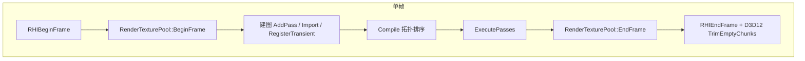
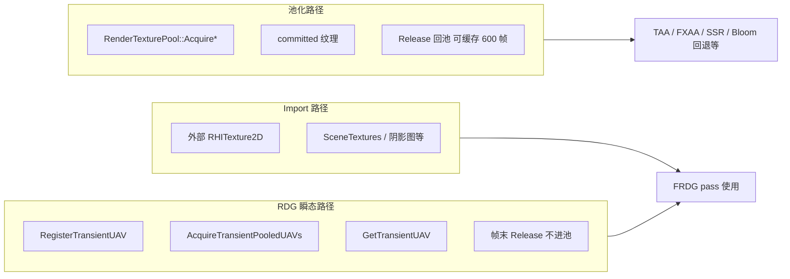

# MiniEngine：RDG 运行逻辑、D3D11/D3D12 资源管理与屏障处理

本文档描述当前代码库（`main` 分支）中帧渲染图（FRDG）、跨帧纹理池、D3D12 瞬态 Aliasing 堆，以及资源状态 / 屏障的分工。面向维护渲染与 RHI 的开发者。

---

## 目录

1. [总览与术语](#1-总览与术语)
2. [单帧时间线](#2-单帧时间线)
3. [FRDGBuilder 运行逻辑](#3-frdgbuilder-运行逻辑)
4. [资源的三条分配路径](#4-资源的三条分配路径)
5. [RenderTexturePool（跨帧池化）](#5-rendertexturepool跨帧池化)
6. [D3D12 资源管理](#6-d3d12-资源管理)
7. [D3D11 资源管理](#7-d3d11-资源管理)
8. [屏障与状态转换](#8-屏障与状态转换)
9. [后处理与池化对照表](#9-后处理与池化对照表)
10. [关键源文件索引](#10-关键源文件索引)
11. [调试与常见问题](#11-调试与常见问题)

---

## 1. 总览与术语

| 术语 | 含义 |
|------|------|
| **FRDG** | `Engine::FRDGBuilder`，帧内 pass 图：登记 pass、编译顺序、按序执行 |
| **Import** | 外部已存在的 `RHITexture2D`，图只调度与 barrier，不拥有寿命 |
| **RDG 瞬态 UAV** | `RegisterTransientUAV` + 图执行期 `AcquireTransientPooledUAVs`，帧末销毁，**不进** `RenderTexturePool` |
| **池化路径** | `RenderTexturePool::Acquire*` → committed 资源，可跨帧缓存 |
| **Pass-begin barrier** | 每个 RDG pass 执行前，根据 `FRDGResourceAccess` 批量 transition（UE Epilogue 风格） |
| **Aliasing heap** | D3D12 上大堆 + 多 slot 放置纹理，GPU 时间上不交叠的 UAV 复用同一 VRAM 偏移 |



---

## 2. 单帧时间线

### 2.1 引擎挂钩

`MainEngine` 初始化 RHI 时注册帧回调（`Engine/Src/Engine/Engine.cpp`）：

- `RHIBeginFrame` → `RenderTexturePool::BeginFrame()`（`FrameCounter++`）
- `RHIEndFrame` → `RenderTexturePool::EndFrame()`（驱逐旧条目、按 budget 裁剪）

D3D12 另外在 `D3D12DynamicRHI::RHIEndFrame` 中调用 `TransientAliasingPool::TrimEmptyChunks()`，在池 `EndFrame` 之后释放空闲 aliasing heap。

### 2.2 主场景帧图（`SceneRenderer`）

典型一帧（简化）：

1. 创建栈上 `FRDGBuilder Graph`
2. `ImportTexture`：SceneColor、Depth、GBuffer 等（来自 `FSceneTextures`，多为池化纹理）
3. `AddPass`：Shadow、BasePass、DeferredLighting、Translucent、PostProcess…
4. `PostProcessor::AddFramePasses`：后处理 pass + `RegisterBloomTransientUAVs`
5. `Graph.Compile(RDGCompileParams)`
6. 填充 `FRDGCompileParameters`：
   - `RDGBarrierCommandContext` = 录制用 `RHICommandContext`
   - **`RDGAcquirePooledResourcesRHI` = `RHI`**（必须设置，否则 RDG 瞬态 UAV 不会分配）
7. `Graph.ExecutePasses(RDGExecParams)` 或 compile 失败时 `ExecutePassesInSetupOrder`

参考：`Engine/Src/Engine/Render/SceneRendering/SceneRenderer.cpp`（约 469–479 行）。

### 2.3 与线程 / Flush 的关系

录制与提交语义见 `Render/RHI/RHIPathContracts.h`：

- **录制线程**上构建 command list、写入 barrier
- `FlushRenderingCommands` ≠ GPU idle；完全空闲用 `RHIWaitForGpuIdle`
- D3D12 有 `ERHIRecordingContextScope` 栈（帧边界、资源上传、Present 等）

---

## 3. FRDGBuilder 运行逻辑

实现：`Engine/Engine/Render/RDGBuilder.h`、`Engine/Src/Engine/Render/RDGBuilder.cpp`。

### 3.1 建图阶段（每帧一次）

| API | 作用 |
|-----|------|
| `ImportTexture(Name, Resolve, Required)` | 登记外部纹理；pass IO 用 **名字** 连边 |
| `RegisterTransientUAV(Name, ResolveDesc)` | 登记本帧瞬态 UAV 规格（格式、宽高），**尚未分配 GPU** |
| `AddPass(FRDGPassDescriptor)` | 登记 pass：`Inputs`/`Outputs`（含 `FRDGResourceAccess`）、`Execute` lambda |
| `AddPassDependency(Producer, Consumer)` | 无同名纹理时的显式调度边（如 Shadow → BasePass） |

`FRDGPassDescriptor` 重要字段：

- `Access`：`SRV` / `UAV` / `RTV` / `DSV` / `CopySrc` / `CopyDst` / `Unknown`（Unknown 不参与 pass-begin barrier）
- `SubresourceIndex`：默认 `FRDGAllSubresources`；mip 级 RT 可指定子资源
- `bUnbindRenderTargetsBeforeRDGBarriers`：pass 前空 OM，避免 DSV/RTV 阻塞合法 transition
- `Queue`：`Graphics` / `AsyncCompute` / `Copy`（多队列排序未完整实现，仅警告）

### 3.2 编译阶段 `Compile`

1. 从 pass 的 Input/Output **名字** 推导资源流边（最后写者 → 读者）
2. 合并 `AddPassDependency` 的显式边
3. 拓扑排序 → `LastCompiledOrder`
4. 可选：**Sink 可达性裁剪**（`RDG_GraphSink` 为根，如 `UIPresent`）
5. 环检测；失败时 `bHadCycle`，执行阶段可能走 `ExecutePassesInSetupOrder`

### 3.3 执行阶段 `ExecutePassesImpl`

对每个 `LastCompiledOrder` 中的 pass（顺序如下）：

```text
1. [可选] bUnbindRenderTargetsBeforeRDGBarriers
      → RHIBeginRenderPass(空 desc) 解绑 OM

2. [可选] bRDGAutoPipelineBarriers
      → FRDGUtils::AppendPassTextureBarriers(Pass, scratch)
      → RDGBarrierCommandContext->RDGApplyPassBeginBarriers(...)

3. FTransientPooledScope（整段 ExecutePasses 仅一次）
      → 若 RDGAcquirePooledResourcesRHI 非空且存在 RegisterTransientUAV：
           AcquireTransientPooledUAVs(RHI)
      → 执行各 pass 的 Execute()
      → ReleaseTransientPooledUAVs()（clear LiveTransientUAVByName）

4. [可选] GPU pass timestamps / RenderTexturePool 统计日志
```

**注意**：瞬态 UAV 在**整图执行开始**时统一 Acquire，在**整图结束**时统一 Release，不是 per-pass 分配。

### 3.4 `FRDGCompileParameters` 常用字段

| 字段 | 说明 |
|------|------|
| `RDGBarrierCommandContext` | 接收 `RDGApplyPassBeginBarriers` 的 context（与 pass 同一录制列表） |
| `RDGAcquirePooledResourcesRHI` | 非空时才执行 `AcquireTransientPooledUAVs` |
| `bRDGAutoPipelineBarriers` | 默认 true；为 false 则跳过 pass-begin barrier |
| `bLogRenderTexturePoolStats` | 图执行后打池统计 |
| `PassCpuTimingsOut` | 每 pass CPU 时间；GPU 列为上一帧 timestamp（若启用） |

---

## 4. 资源的三条分配路径



### 4.1 Import 路径

- 纹理生命周期由 **SceneTextures / 模块** 管理
- RDG 只通过 `Resolve` lambda 取 `shared_ptr`，在 pass 间声明读写依赖
- Pass-begin barrier 根据 `FRDGPassResource::Access` 转换状态

### 4.2 RDG 瞬态路径（当前仅 Bloom 链）

流程：

1. `PostProcessor::RegisterBloomTransientUAVs` → `Bloom.Chain0` … `Bloom.Chain4`
2. `ExecutePasses` 内 `AcquireTransientPooledUAVs`：
   `RHI->RHICreateUnorderedAccessViewForTransientPool(fmt, w, h, **true**)`
3. `BloomPass::Execute` → `GetTransientUAV("Bloom.ChainN")` → `Bloom::Draw(..., &Pooled)`
4. 图结束 `ReleaseTransientPooledUAVs` → `shared_ptr` 析构 → D3D12 还 aliasing slot

若 `GetTransientUAV` 全失败，`BloomPass` 走 `Bloom::Draw(..., nullptr)` → 内部 `RenderTexturePool::AcquireUAV`（池化回退）。

### 4.3 池化路径

- `AcquireUAV` → `RHICreateUnorderedAccessViewForTransientPool(..., **false**)` → 普通 committed `RHICreateTexture2D`
- 用于 **跨帧** 保留的缓冲（TAA 历史、FXAA RT、SSR 纹理、Bloom 回退等）

---

## 5. RenderTexturePool（跨帧池化）

实现：`Engine/Engine/Render/RenderTexturePool.h`、`Engine/Src/Engine/Render/RenderTexturePool.cpp`。

### 5.1 键与缓存

| 类型 | Key | 默认每 key 最多缓存 |
|------|-----|---------------------|
| Tex2D | Format + Flags + W + H + NumMips | 8 |
| UAV | Format + W + H | 8 |
| RT | Format + W + H + NumMips + MS + Depth | 8 |

### 5.2 帧末维护

`EndFrame()`：

1. `kEvictAfterFrames`（600）未使用的条目删除
2. 若 `EstimatedBytesFree > BudgetBytes`（默认 512MB），按最旧条目 LRU 式删除直到低于预算

配置 JSON：`RenderTexturePool.BudgetMB` / `BudgetBytes`（`ApplyConfigFromJson`）。

### 5.3 与 Aliasing 的关系

**池内 UAV 一律 committed**，不持有 `FD3D12AliasingSlotLease`。  
Aliasing 仅用于 RDG 瞬态、且 `bPreferAliasingHeap == true` 的创建路径。

---

## 6. D3D12 资源管理

### 6.1 纹理创建方式

| 方式 | 入口 | 底层 |
|------|------|------|
| Committed | `RHICreateTexture2D` / 池化 `AcquireUAV(false)` | `CreateCommittedResource` |
| Placed（瞬态） | `TryCreateTransientAliasingUAV` | `FD3D12TransientAliasingPool::TryAllocatePlacedUAVTexture2D` |

`RHICreateUnorderedAccessViewForTransientPool`（`D3D12DynamicRHI`）：

- `bPreferAliasingHeap == false` → committed
- `true` 且 pool 可用 → `D3D12Texture2D::TryCreateTransientAliasingUAV`；失败则回退 committed

### 6.2 瞬态 Aliasing 池

类：`FD3D12TransientAliasingPool`（`Render/D3D12/D3D12TransientAliasingPool.h`）。

- 按 `FD3D12AliasingTexLayoutKey`（格式、尺寸、flags）分桶
- 每桶多个 **Chunk**，每 chunk **16 slot**，slot 大小由 `GetResourceAllocationInfo` 对齐
- 每 Layout 最多 **2 个 chunk**（`kMaxChunksPerLayout`），超出分配失败 → RHI 回退 committed
- `FD3D12AliasingSlotLease` 析构 → `ReleaseSlot` → 记 `SlotRetireFence`，GPU 完成后 slot 可复用
- `TrimEmptyChunks()`：某 chunk 全 slot 空闲且 fence 完成 → 释放 `ID3D12Heap`

帧末：`D3D12DynamicRHI::RHIEndFrame` 调用 `TrimEmptyChunks()`。

### 6.3 Command List 上的资源状态

`D3D12CommandContext` / `D3D12CommandListHandle` 维护 **`CResourceState`**（每资源每子资源当前 D3D12 状态）：

- `TransitionResource` / `TransitionSubResource`：若 `Before == NewState` **不插入** barrier
- `D3D12_RESOURCE_STATE_TBD`：首次使用记 pending barrier
- 列表状态与全局 `FD3D12Resource` 状态在打开新 list 时同步（见 `ConditionalInitialize`）

OM 绑定时（`SetRenderTarget` 等）也会对 RTV/DSV 调用 `TransitionSubResource`，目标状态与 RDG 映射一致（`D3D12RdgAccessToResourceState`）。

### 6.4 统一 Access → State 映射

`Render/D3D12/D3D12RDGBarriers.h`、`Render/Src/D3D12/D3D12RDGBarriers.cpp`：

| FRDGResourceAccess | D3D12 状态（典型） |
|--------------------|-------------------|
| SRV（2D） | `PIXEL_SHADER_RESOURCE` 或 `NON_PIXEL_SHADER_RESOURCE`（async/compute） |
| SRV（平面 depth） | 可能按 plane 循环 transition |
| UAV | `UNORDERED_ACCESS` |
| RTV | `RENDER_TARGET` |
| DSV | `DEPTH_WRITE` |
| CopySrc / CopyDst | `COPY_SOURCE` / `COPY_DEST` |

`D3D12RdgApplyTextureBarriers` 被 `RDGApplyPassBeginBarriers` 与逻辑上等价的 RenderPass 路径共用。

---

## 7. D3D11 资源管理

### 7.1 与 D3D12 的差异

| 能力 | D3D11 | D3D12 |
|------|-------|-------|
| 显式 ResourceBarrier | 无（运行时推断） | 有，需跟踪状态 |
| `RDGApplyPassBeginBarriers` | **空实现**（no-op） | 完整 transition + flush |
| Transient Aliasing Pool | 无 | 有 |
| RenderTexturePool | 同样使用 | 同样使用 |

`D3D11CommandContext::RDGApplyPassBeginBarriers` 忽略所有 `FRDGTextureBarrierDesc`（`Render/Src/D3D11/D3D11CommandContext.cpp`）。

### 7.2 实际屏障从哪来（D3D11）

- `RHIBeginRenderPass` 推断的 barrier 在 D3D11 上同样进入 `RHIRenderPassApplyDeclaredTextureBarriers` → 仍为 no-op
- 依赖 D3D11 驱动在 `OMSetRenderTargets` / `CSSetShaderResources` 等调用时的状态推断
- `FRDGPassDescriptor` 上的 `Access` 主要为跨 API 统一与未来 D3D11 扩展预留

### 7.3 资源创建

- 池化与非池化路径与引擎层一致（`RenderTexturePool`、`FRDG` 逻辑相同）
- 无 `FD3D12AliasingSlotLease`；UAV 均为常规 `ID3D11Texture2D`

---

## 8. 屏障与状态转换

### 8.1 三层 barrier 来源

```text
┌─────────────────────────────────────────────────────────────┐
│ 1. RDG pass-begin（自动）                                    │
│    AppendPassTextureBarriers(Pass IO)                       │
│    → RDGApplyPassBeginBarriers                              │
├─────────────────────────────────────────────────────────────┤
│ 2. RHIBeginRenderPass（推断 + 声明）                       │
│    bInferAttachmentBarriers / ShaderResourceReads           │
│    → DeclaredTextureBarriers → RHIRenderPassApplyDeclared…  │
├─────────────────────────────────────────────────────────────┤
│ 3. 绑 OM / SRV / Copy 时（D3D12）                           │
│    SetRenderTarget / SetShaderResource / RHICopyResource    │
│    → TransitionSubResource（已与 RDG 映射统一）             │
└─────────────────────────────────────────────────────────────┘
```

**去重机制**：不再使用 thread_local `DupSuppress`；依赖 `CResourceState` 在 `Before == NewState` 时跳过重复 `ResourceBarrier`。

### 8.2 RDG pass-begin 流程（D3D12）

对每个执行的 pass：

1. 可选：空 `FRHIRenderPassDesc` 解绑 OM
2. `FRDGUtils::AppendPassTextureBarriers`：把 pass `Inputs`/`Outputs` 转为 `FRDGTextureBarrierDesc`
3. `D3D12CommandContext::RDGApplyPassBeginBarriers`：
   - 调用 `D3D12RdgApplyTextureBarriers`
   - `CommandListHandle.FlushResourceBarriers()`

### 8.3 RHIRenderPass（`Render/RHI/RHIRenderPass.h`）

`RHIBeginRenderPass` 顺序：

1. 推断 attachment（RTV/DSV）与 `ShaderResourceReads`（SRV）→ 合并进 `DeclaredTextureBarriers`
2. `RHIRenderPassApplyDeclaredTextureBarriers`（D3D12 上与 RDG 相同实现）
3. `SetRenderTarget` / viewport

推断规则要点：

- `ColorRenderTarget` + mip：对该 **mip 子资源** RTV barrier
- MRT `ColorTargets`：RTV 使用 **`FRdgOmRtvBindSubresourceIndex`（0）**，与 `SetRenderTarget` MRT 路径一致
- Depth：`FRDGAllSubresources` → `TransitionResource`

### 8.4 子资源策略（避免双 barrier / 状态错乱）

| 场景 | 建议 subresource |
|------|------------------|
| Pass IO 整纹理读写 | `FRDGAllSubresources` |
| MRT 绑 mip0 RTV | `FRdgOmRtvBindSubresourceIndex` (0) |
| RT mip 链降采样 | `ColorRenderTargetMipIndex` 对应 mip |
| 平面 depth SRV | D3D12 按 plane 循环 transition |

### 8.5 FRDGResourceAccess 枚举

定义：`Render/RHI/RDGResourceAccess.h`。

引擎工具函数：`Engine/Engine/Render/RDGUtils.h`

- `RHICmdListDeclarePixelSamplingSrvs` → 批量 SRV barrier
- `AppendFullscreenDeclaredTextureBarriers` → 全屏 pass 的 SRV + RTV 声明

---

## 9. 后处理与池化对照表

主路径：`SceneRenderer` → `PostProcessor::AddFramePasses`（非 `PostProcessor::Draw`）。

| 模块 | 分配方式 | 池 | D3D12 Aliasing |
|------|----------|----|----------------|
| Bloom（RDG 成功） | `RegisterTransientUAV` → `Bloom.Chain*` | 否 | **是** |
| Bloom（回退） | `RenderTexturePool::AcquireUAV` | 是 | 否 |
| TAA | `AcquireUAV` | 是 | 否 |
| FXAA | `AcquireRenderTarget` | 是 | 否 |
| SSR | `AcquireTexture2D` | 是 | 否 |
| Blur / DownSample | `AcquireRenderTarget` / `AcquireUAV` | 是 | 否 |
| Tonemapping | 复用 Scene 纹理 | — | — |
| SceneTextures | `AcquireTexture2D` 等 | 是 | 否 |

---

## 10. 关键源文件索引

| 主题 | 路径 |
|------|------|
| FRDG 核心 | `Engine/Engine/Render/RDGBuilder.h`，`Engine/Src/Engine/Render/RDGBuilder.cpp` |
| RDG 工具 / barrier 收集 | `Engine/Engine/Render/RDGUtils.h` |
| 纹理池 | `Engine/Engine/Render/RenderTexturePool.h`，`Engine/Src/Engine/Render/RenderTexturePool.cpp` |
| Access 枚举 | `Render/RHI/RDGResourceAccess.h` |
| RenderPass + 推断 barrier | `Render/RHI/RHIRenderPass.h` |
| D3D12 RDG barrier 实现 | `Render/Src/D3D12/D3D12RDGBarriers.cpp`，`Render/D3D12/D3D12RDGBarriers.h` |
| D3D12 CommandContext / Transition | `Render/Src/D3D12/D3D12CommandContext.cpp` |
| D3D12 Aliasing 池 | `Render/Src/D3D12/D3D12TransientAliasingPool.cpp` |
| D3D12 RHI 创建 UAV | `Render/Src/D3D12/D3D12RHI.cpp`（`RHICreateUnorderedAccessViewForTransientPool`） |
| D3D11 RDG barrier（空） | `Render/Src/D3D11/D3D11CommandContext.cpp` |
| 帧图执行入口 | `Engine/Src/Engine/Render/SceneRendering/SceneRenderer.cpp` |
| Bloom 瞬态注册 | `Engine/Src/Engine/Render/PostProcessor.cpp` |
| Bloom 消费 | `Engine/Src/Engine/Render/PostProcessPass.cpp` |
| RHI 线程 / Flush 契约 | `Render/RHI/RHIPathContracts.h` |
| 帧池回调注册 | `Engine/Src/Engine/Engine.cpp` |

---

## 11. 调试与常见问题

### 11.1 RDG 瞬态 UAV 为空

**现象**：Bloom 总走池化回退，aliasing 从不分配。

**检查**：

1. `FRDGCompileParameters::RDGAcquirePooledResourcesRHI` 是否非空（`SceneRenderer` 必须赋值 `RHI`）
2. 是否调用了 `RegisterTransientUAV`（`RegisterBloomTransientUavs`）
3. `ExecutePasses` 是否在 `Compile` 成功之后调用（失败时仍可能 `ExecutePassesInSetupOrder`，也需同样传参）

### 11.2 显存只涨不降（Aliasing）

- 池内 committed 纹理：看 `RenderTexturePool` budget / evict
- Aliasing heap：看 chunk 是否 `TrimEmptyChunks`；Layout 种类、每 layout 2 chunk 上限
- 瞬态 UAV 不应进池；若误 `ReleaseUAV` 进池会长期占 slot

### 11.3 D3D12 验证层：重复 / 非法 barrier

- 确认 `TransitionSubResource` 跟踪状态是否与 pass 声明一致
- mip 混用：避免整资源 transition 与 per-mip RTV 冲突（见 #527 注释）
- 平面 depth：SRV 需 plane 循环时使用 `D3D12RdgApplyTextureBarrier` 内逻辑

### 11.4 有用命令行 / 日志

- RDG compile 摘要：`FRDGCompileParameters::bLogCompileSummary`
- 池统计：`bLogRenderTexturePoolStats`
- 禁用 GPU pass 时间戳：`-rdg_no_gpu_timestamps`

### 11.5 与 UE RDG 的对照（概念）

| UE | MiniEngine |
|----|------------|
| FRDGBuilder + ERHIAccess | FRDGBuilder + FRDGResourceAccess |
| 编译期合并 barrier | 执行前 per-pass `AppendPassTextureBarriers` |
| RHI transition 去重 | `CResourceState` + `Before != NewState` |
| Transient / External | RDG 瞬态 vs Import / Pool |

---

## 修订记录

| 日期 | 说明 |
|------|------|
| 2026-05-16 | 初版：RDG 执行、双 RHI 资源管理、屏障分层、池化与 aliasing 分工 |
