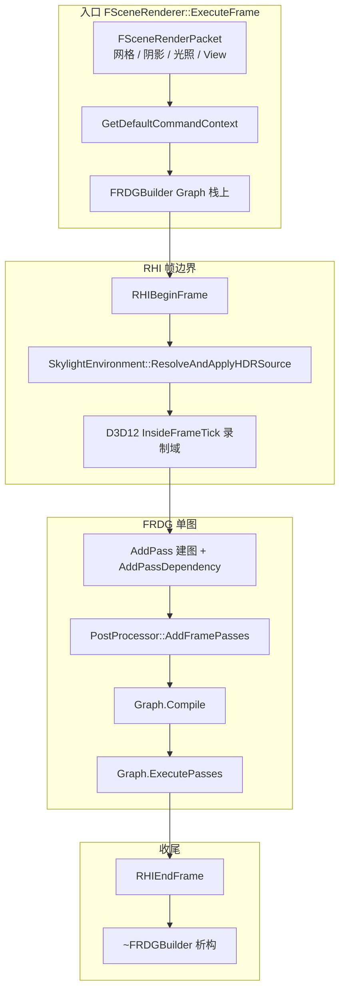
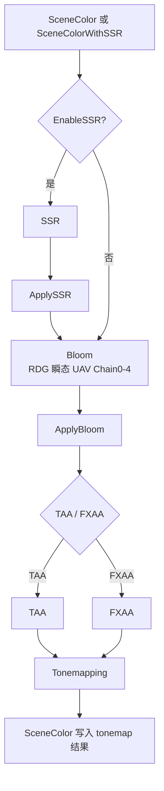
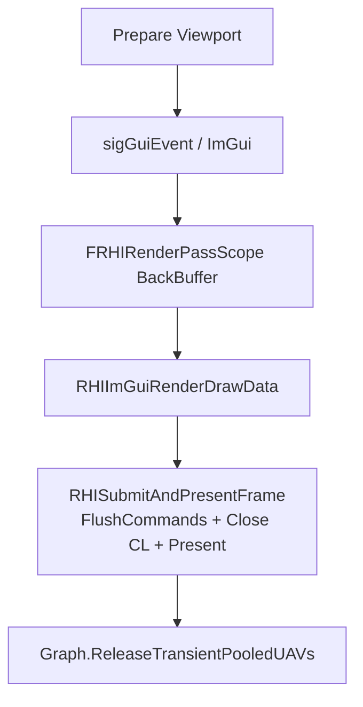

# SceneRenderer 帧渲染流程

本文描述 `FSceneRenderer::ExecuteFrame` 如何构建并执行单帧 FRDG，以及各 Pass 的职责与依赖。文中 Mermaid 图在 Cursor / VS Code 中 `Ctrl+Shift+V` 预览（需 Markdown Preview Mermaid Support 扩展）。

---

## 1. 帧级时间线

---

## 2. Pass 列表（AddPass 顺序）

| 顺序 | Pass 名 | 条件 | 主要工作 |
|------|---------|------|----------|
| 1 | `UpdateSkyLightCaptures` | 有 Skylight | IBL 预计算 / Cubemap 捕获 |
| 2 | `Shadow` | 有阴影投射体或阴影光 | CSM / 点光 / 聚光 depth |
| 3 | `ClearSceneTextures` | 始终 | 清空 GBuffer + Depth，绑定 MRT |
| 4 | `RenderSky` | 始终 | 天空 / 程序化太阳 |
| 5 | `RenderBasePass` | 有网格 | 不透明 GBuffer |
| 6 | `RenderTranslucency` | 非延迟前向路径 | 半透明（否则 no-op） |
| 7 | `DeferredLighting_CopySceneColor` | 延迟且非 Unlit | 拷贝 SceneColor 供光照 |
| 8 | `BuildGpuLightLists` | 同上 | Cluster / Tile 光源列表 CS |
| 9 | `DeferredLighting` | 同上 | 全屏延迟光照 PS |
| 10 | `RenderTranslucentForward` | 同上 | 前向半透明 + 光照 |
| 11 | `RenderFurForward` | 同上 | Fur 壳层前向 |
| 12+ | 后处理 | 见下节 | SSR / Bloom / AA / Tonemap |
| · | `ShadowDebugWire` | 始终登记 | 阴影调试线框 |
| 末 | `UIPresent` | Sink | ImGui + Present + 释放 RDG 瞬态 UAV |

---

## 3. 延迟着色路径（典型 GLFFViewer）

当 `DeferredLighting` 有效且 `!ViewData->bUnlit` 时启用第 7–11 步；`RenderTranslucency` 通常直接返回，半透明改在 `RenderTranslucentForward`。

```mermaid
flowchart LR
  subgraph gbuf [GBuffer]
    CL[ClearSceneTextures]
    SKY[RenderSky]
    BP[RenderBasePass]
  end

  subgraph light [光照]
    CP[DeferredLighting_CopySceneColor]
    GPU[BuildGpuLightLists]
    DL[DeferredLighting]
    TF[RenderTranslucentForward]
    FU[RenderFurForward]
  end

  subgraph post [后处理 PostProcessor]
    SSR[SSR / ApplySSR]
    BL[Bloom / ApplyBloom]
    AA[TAA 或 FXAA]
    TM[Tonemapping]
  end

  subgraph out [输出]
    SD[ShadowDebugWire]
    UI[UIPresent]
  end

  CL --> SKY --> BP
  BP --> CP --> GPU
  GPU --> DL --> TF --> FU
  FU --> SSR --> BL --> AA --> TM --> SD --> UI
```

显式 `AddPassDependency`（与资源边叠加）：

- `Shadow` → `ClearSceneTextures` / `RenderBasePass` / `DeferredLighting` / …
- `BuildGpuLightLists` → `DeferredLighting`、`RenderTranslucentForward`、`RenderFurForward`
- `RenderFurForward` → `Tonemapping`
- `Tonemapping` → `ShadowDebugWire` → `UIPresent`

---

## 4. 后处理子图（PostProcessor::AddFramePasses）

由 `SceneRenderer` 在同一 `FRDGBuilder` 上调用，Pass 插入在 Fur 与 ShadowDebug 之间（AddPass 顺序在 Tonemapping 之前）。

| Pass | 资源依赖（RDG 名） |
|------|-------------------|
| `SSR` | 读 `ReflectionColor`，写 SSR buffer |
| `ApplySSR` | 读 SSR + SceneColor → `SceneColorWithSSR` |
| `Bloom` | 读 `SceneColor` 或 `SceneColorWithSSR`，写 `BloomResult`（瞬态 UAV） |
| `ApplyBloom` | 合成 → `SceneColorWithBloom` |
| `TAA` / `FXAA` | 读 anti-aliasing 源，写历史或 `FXAAResult` |
| `Tonemapping` | 读 `SceneColor` 或 `FXAAResult`，写 `SceneColor` |

---

## 5. UIPresent（图 Sink）

- `RDG_GraphSink`：以该 Pass 为终点往回追依赖，用于跳过与上屏无关的可选 Pass（见 [FRDG-Compile-Execute.md](FRDG-Compile-Execute.md) §4）
- **必须在 `RHISubmitAndPresentFrame` 之后** 再释放 Bloom 瞬态纹理（D3D12 命令列表已关闭）

---

## 6. 场景纹理（Import 语义）

`GatherSceneTexturesPassResources` 为 GBuffer Pass 提供统一 IO 名：

| RDG 名 | `FSceneTextures` |
|--------|------------------|
| `SceneColor` | GetSceneColor |
| `MotionVector` | GetMotionVector |
| `Normal` | GetNormalBuffer |
| `Emissive` | GetEmissiveBuffer |
| `MetallicRoughness` | GetMetallicRoughnessBuffer |
| `MaterialAux` | GetMaterialAuxBuffer |
| `Depth` | GetDepth |

后处理还会 `ImportTexture("ReflectionColor")` 等，见 `PostProcessor.cpp`。

---

## 7. 配置与调试

| 手段 | 说明 |
|------|------|
| 场景 JSON `RDG.LogCompileSummary` | 日志打印拓扑序 Pass 名链 |
| FRDG 文档 | [FRDG-Compile-Execute.md](FRDG-Compile-Execute.md) |

---

## 8. 源文件索引

| 文件 | 职责 |
|------|------|
| `Engine/Src/Engine/Render/SceneRendering/SceneRenderer.cpp` | `ExecuteFrame` 建图、Compile、Execute |
| `Engine/Src/Engine/Render/PostProcessor.cpp` | 后处理 Pass 登记 |
| `Engine/Src/Engine/Render/WorldSceneRender.cpp` | JSON → `RDGCompileParams` |
| `Engine/Engine/Render/WorldSceneRenderPrivate.h` | `RDGCompileParams` 成员 |
