# MiniEngine 阴影绘制流程说明

本文描述 **Shadow RDG Pass** 从场景数据收集、深度贴图生成，到延迟光照中 **PCSS 采样** 的完整链路。帧级总览见 [`SceneRenderer-Frame-Graph.md`](SceneRenderer-Frame-Graph.md)；光照计算（Cluster、全屏 Deferred、前向半透明）见 [`Lighting-Rendering.md`](Lighting-Rendering.md)。

---

## 1. 相关源码

| 模块 | 路径 |
|------|------|
| RDG 调度 | `Engine/Src/Engine/Render/SceneRendering/SceneRenderer.cpp` → Pass `"Shadow"` |
| 阴影 Pass 入口 | `Engine/Src/Engine/Render/Shadow/ShadowRenderPass.cpp` |
| 视图数据聚合 | `Engine/Src/Engine/Render/Shadow/FShadowViewData.cpp` |
| 平行光 depth | `Engine/Src/Engine/Render/Shadow/FDirectionalShadowDepthPass.cpp` |
| 视锥拟合 | `Engine/Src/Engine/Render/Shadow/FDirectionalShadowFrustumFitter.cpp` |
| 点光立方体 | `Engine/Src/Engine/Render/Shadow/FPointShadowCubePass.cpp` |
| 聚光 depth | `Engine/Src/Engine/Render/Shadow/FSpotShadowDepthPass.cpp` |
| Mesh 绘制 | `Engine/Src/Engine/Render/Shadow/FShadowDepthMeshDrawer.cpp` |
| 单 Mesh VS/PS | `Engine/Src/Engine/Render/Shadow/FShadowPassMeshDraw.cpp` |
| 深度 VS/PS | `Render/ShaderLibDX/ShadowPass-VS.hlsl`, `ShadowPass-PS.hlsl` |
| 延迟采样 | `Render/ShaderLibDX/DirectionalShadow.hlsl`, `ShadowPCSS.hlsl`, `SpotShadowSampling.hlsl` |
| 延迟绑定 | `Engine/Src/Engine/Render/SceneRendering/DeferredLightingPass.cpp` |
| 场景快照 | `Engine/Engine/Render/Shadow/ShadowProjectorTypes.h` → `FShadowProjectorSceneData` |

---

## 2. 阴影在帧管线中的位置

阴影 Pass 在 **Skylight 更新之后、清空 GBuffer 之前** 执行，保证后续 BasePass / DeferredLighting 能绑定已生成的 depth 比较采样纹理。

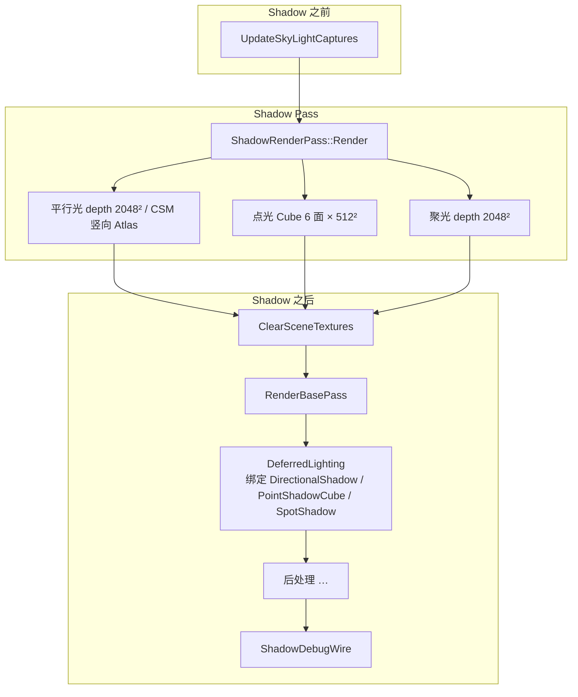

**RDG 依赖**（`SceneRenderer`）：`Shadow` → `ClearSceneTextures` / `RenderBasePass` / `DeferredLighting` / …（见帧图文档 §5）。

---

## 3. 游戏线程 → 渲染包（输入侧）

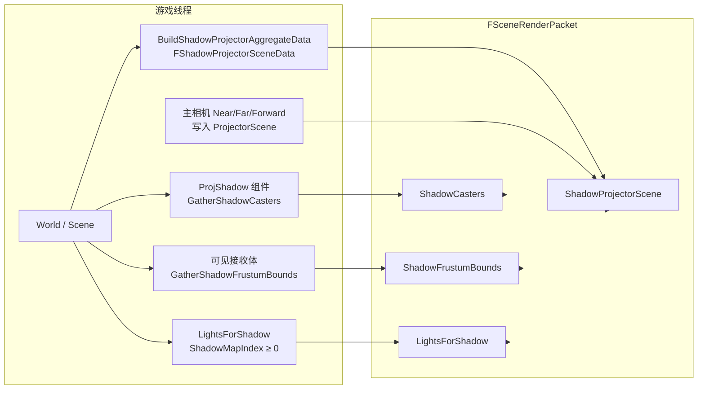

| 列表 | 用途 |
|------|------|
| `ShadowCasters` | 仅 **ProjShadow** 标记的 Actor 网格，**实际写入** depth 贴图 |
| `ShadowFrustumBounds` | 可见接收体（如地面）并集 AABB，用于 **平行光/聚光视锥** 拟合，避免大平面缺影 |
| `LightsForShadow` | 本帧参与阴影的光源副本；`ShadowMapIndex` 决定点光/聚光槽位 |
| `FShadowProjectorSceneData` | 相机 ze 范围、CSM 开关与 split、可选 ProjShadow 模型 AABB、主视图世界包围盒（收紧平行光 XY） |

**是否调度 Shadow Pass**（`SceneRenderer`）：

```text
bScheduleShadowPass =
  ShadowCasters 非空
  || ShadowFrustumBounds 非空
  || ShadowProjectorScene.bValid
  || 任意 Light.ShadowMapIndex >= 0
```

若不调度，则 `InvalidateCachedMainLightForShading()`，延迟光照使用上一帧无效化后的 fallback 深度纹理。

---

## 4. ShadowRenderPass::Render 总流程

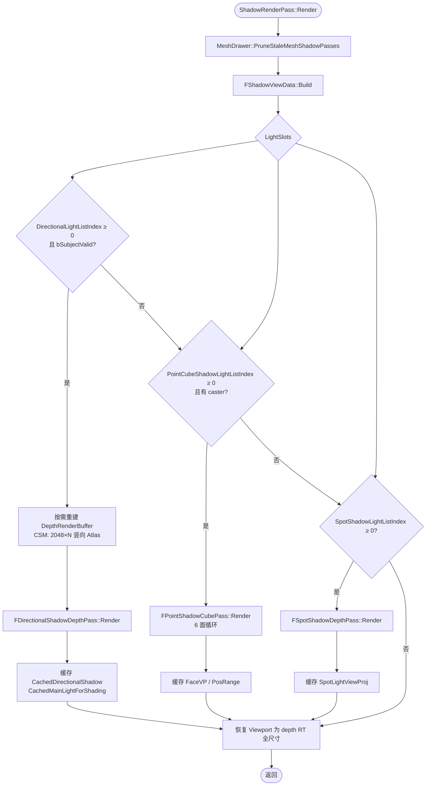

---

## 5. FShadowViewData::Build（单帧阴影上下文）

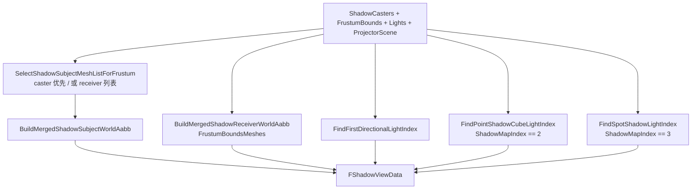

---

## 6. 平行光深度（FDirectionalShadowDepthPass）

### 6.1 单贴图 vs CSM 竖向 Atlas

| 模式 | RT 尺寸 | Viewport | CB `cbDirectionalShadow` |
|------|---------|----------|---------------------------|
| 非 CSM | 2048 × 2048 | 全图 | `DirectionalCSMEnabled=0`, `CascadeCount=1`, `CascadeViewProj[0]` |
| CSM（2–3 级） | 2048 × (2048×N) | 每级 `vpY = ci × 2048` | `DirectionalCSMEnabled=1`, `CascadeSplits`（ze 分界）, `CascadeViewProj[0..2]` |

`bDirectionalShadowCSM` 与 `DirectionalShadowCSMCascadeCount` 来自 `FShadowProjectorSceneData`（场景/世界设置）。

### 6.2 非 CSM 流程

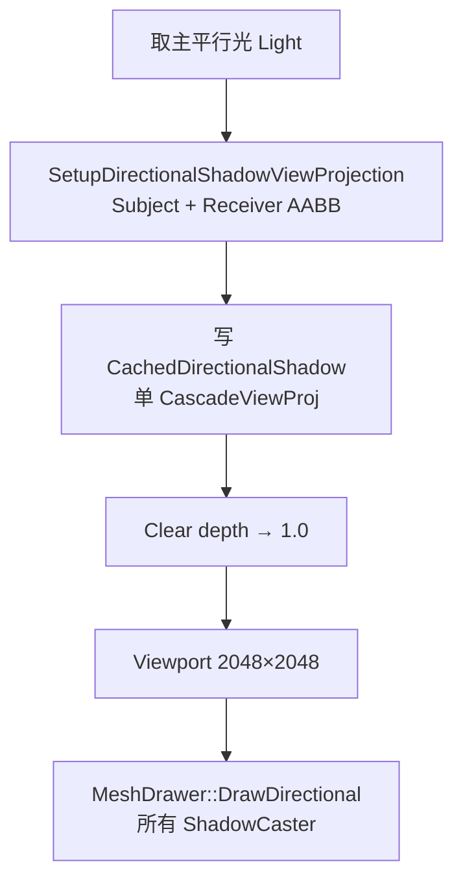

### 6.3 CSM 流程（每级 Cascade）

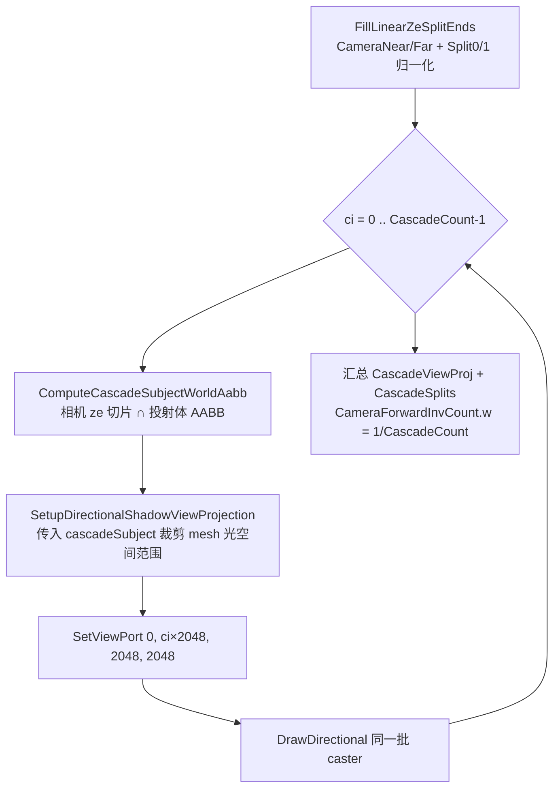

**视锥拟合要点**（`FDirectionalShadowFrustumFitter`）：

- 正交投影包围 **Subject**（投射体）与 **Receiver**（接收体 XY，低角度阳光时与主视图包围盒求交）。
- **Texel snap**：平移 `LightView` 使阴影稳定，减少相机平移时的阴影游泳。
- CSM 每级必须用 **该级 cascade subject**，否则全场景 mesh 合并会导致各级 ortho 相同、depth 重复。

### 6.4 平行光视锥拟合（概念）

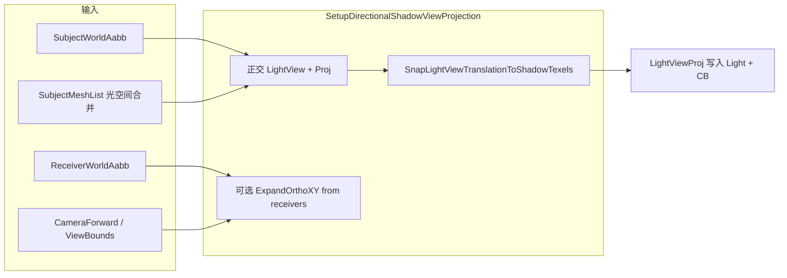

---

## 7. 点光立方体阴影（FPointShadowCubePass）

```mermaid
flowchart TB
  FIND[首个 Point + ShadowMapIndex==2] --> CLEAR[对 Cube 每个 face Clear depth]
  CLEAR --> FACE{face 0..5}
  FACE --> VP[ComputePointShadowFaceViewProj<br/>90° FOV, zNear=0.05, zFar=Range]
  VP --> DRAW[MeshDrawer::DrawCubeFace]
  DRAW --> FACE
  FACE --> CACHE[CachedPointFaceVP[6] + LightPosRange]
```

- 资源：`PF_ShadowDepth` Cube，**512×512×6**。
- 延迟阶段：`CBPointShadow` + `PointShadowCube` SRV，在光照循环中对 `LightIndex` 匹配的点光做立方体 PCF。

---

## 8. 聚光阴影（FSpotShadowDepthPass）

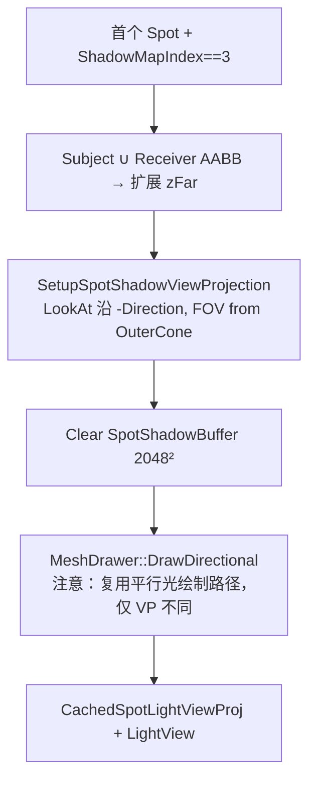

- 无 caster 时可用 `FrustumBoundsMeshes` 仅驱动 zFar（仍可能绘制空 depth）。
- 延迟：`CBSpotShadow` + `SpotShadow` 2D 比较深度 + `SpotShadowSampling.hlsl`。

---

## 9. 深度 Mesh 绘制（FShadowDepthMeshDrawer / FShadowPassMeshDraw）

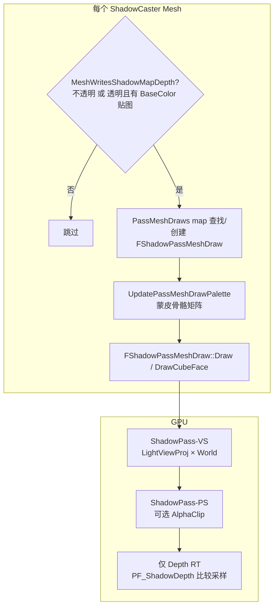

| 规则 | 说明 |
|------|------|
| `MeshWritesShadowMapDepth` | 不透明材质写 depth；透明需有 albedo 纹理才 clip 写影 |
| `kMatShaderFlag_ShadowAlphaClip` | PS 对 albedo.a 做 `clip` |
| 缓存 | 按 `MeshBase*` 缓存 VS/IL；场景切换时 `ClearCachedMeshShadowPasses` |

---

## 10. 延迟光照消费（采样阶段）

Shadow Pass **只生成 depth**；可见性在 **DeferredLighting / Forward** 的 PS 中计算。

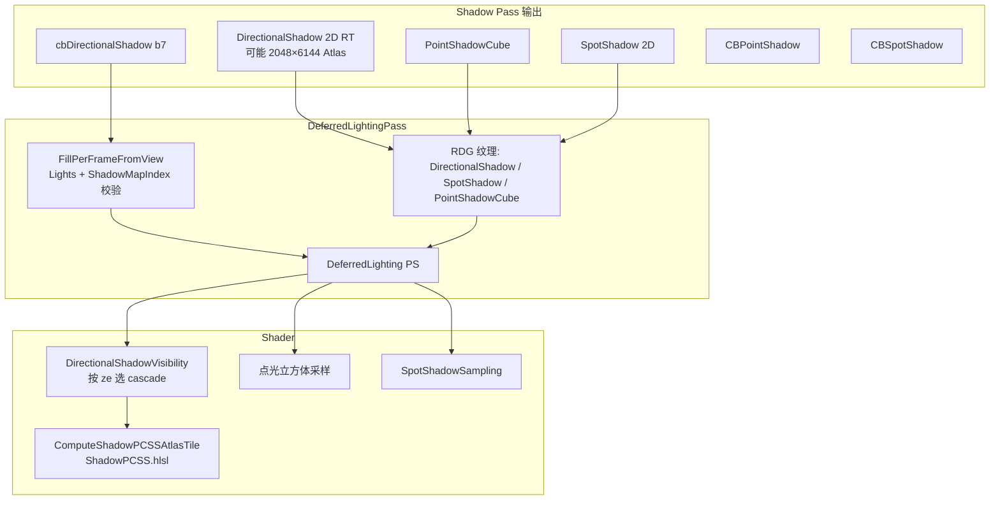

**平行光 CSM 采样**（`DirectionalShadow.hlsl`）：

1. `ze = dot(worldPos - camPos, CameraForward)`。
2. 与 `CascadeSplits` 比较得到 `idx`（0..CascadeCount-1）。
3. `world → CascadeViewProj[idx] → NDC → Atlas 行 idx`（`CameraForwardInvCount.w` 为每行高度比例）。
4. `ComputeShadowPCSSAtlasTile` 做 PCSS（块搜索 + 滤波）。

主平行光 `Light.ShadowMapIndex == 0` 且存在有效 `GetShadowMap()` 时才保留阴影；否则置 `-1` 并绑定 fallback 比较深度纹理。

---

## 11. 资源与常量一览

| 资源 | 格式 | 分辨率 | ShadowMapIndex |
|------|------|--------|----------------|
| 平行光 depth | `PF_ShadowDepth` RT | 2048² 或 2048×(2048×N) | 0（主平行光） |
| 点光 cube | `PF_ShadowDepth` Cube | 512²×6 | 2（`kPointLightCubeShadowMapIndex`） |
| 聚光 depth | `PF_ShadowDepth` RT | 2048² | 3（`kSpotLightShadowMapIndex`） |

**Clear 值**：深度清为 **1.0**（远平面），与 D3D 深度比较一致。

---

## 12. 调试与失效

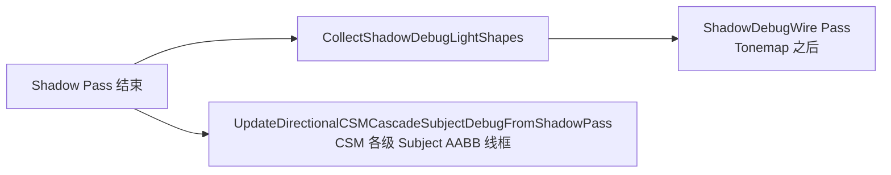

- 场景切换：`FlushClearShadowPassMeshCacheNow` → `InvalidateCachedMainLightForShading` + `ClearCachedMeshShadowPasses`。
- CSM Atlas 尺寸变化会 **重建** `DepthRenderBuffer` 并清空 Mesh 阴影 Pass 缓存。

---

## 13. 端到端数据流（一图总览）

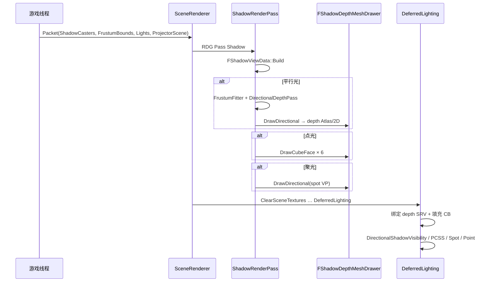

---

## 14. 与半透明 / Fur 的关系

- **半透明前向**、**Fur** 在 Shadow Pass **之后** 执行，不参与 depth 贴图生成。
- 半透明/Fur 光照可读 `cbDirectionalShadow` 与主平行光 PCSS（与延迟共用 `DirectionalShadow.hlsl` 思路）。
- 运动矢量 MRT 与阴影 depth **独立**；TAA 不直接依赖阴影贴图。

---

*文档版本与代码一致点：Shadow Pass 在 `ClearSceneTextures` 之前；平行光 CSM 为竖向 Atlas；每帧每种局部光型各占用一个 shadow 槽（首个匹配光源）。*
