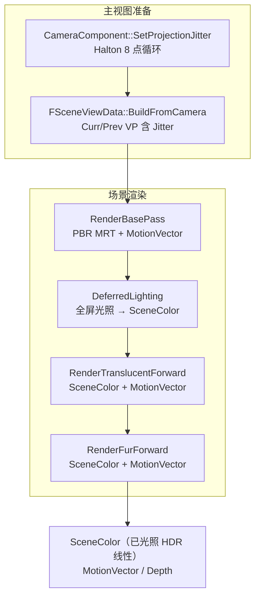
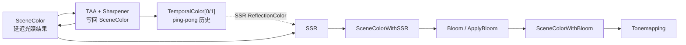
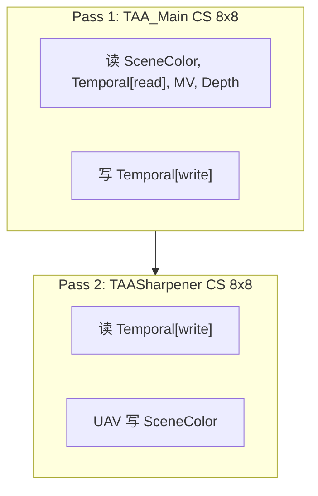
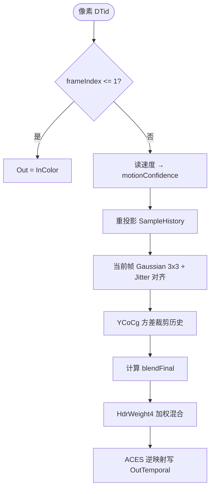
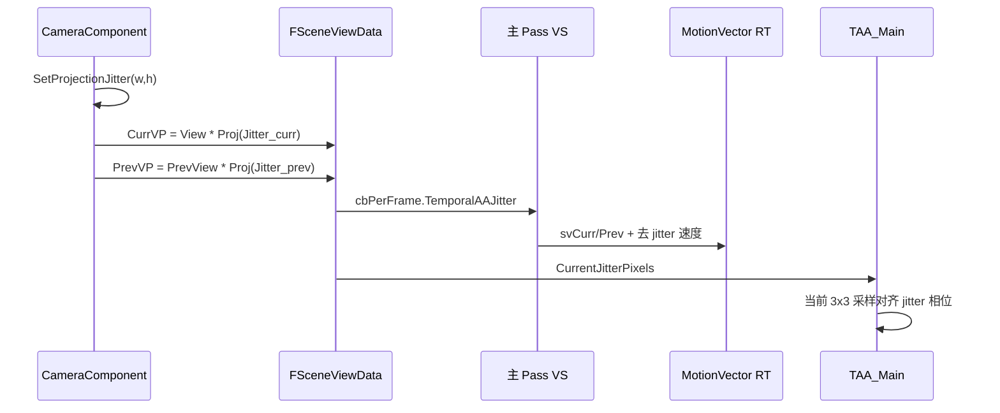
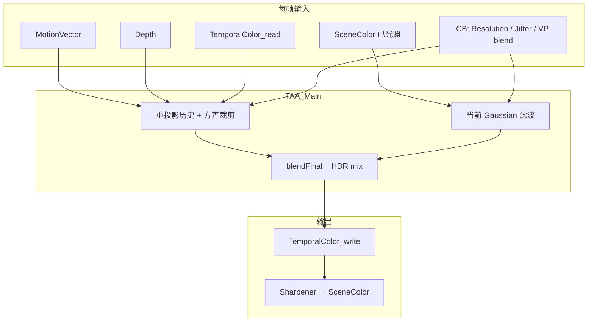

# MiniEngine 时间抗锯齿（TAA）算法说明

本文描述当前工程中 **TAA 的输入前提、帧内位置、C++ 调度、Compute Shader 逐像素流程与调参常量**。实现以 Frostbite/UE4 风格 **Karis TAA**（YCoCg 方差裁剪 + HDR 加权混合）为主干，并针对漫游相机与金属高光做了扩展。

相关源码：

| 模块 | 路径 |
|------|------|
| 主 Pass | `Render/ShaderLibDX/TAACS.hlsl` → `TAA_Main` |
| 锐化 Pass | `Render/ShaderLibDX/TAASharpenerCS.hlsl` → `mainCS` |
| C++ 调度 | `Engine/Src/Engine/Render/TemporalAA.cpp` |
| RDG 封装 | `Engine/Src/Engine/Render/PostProcessPass.cpp` → `TAAPass` |
| 后处理编排 | `Engine/Src/Engine/Render/PostProcessor.cpp` |
| 运动矢量 | `Render/ShaderLibDX/MotionVectorFromClip.hlsl` |
| 相机 Jitter | `Engine/Src/Engine/Scene/CameraComponent.cpp` |

帧级总览另见 [`SceneRenderer-Frame-Graph.md`](SceneRenderer-Frame-Graph.md)。

---

## 1. TAA 在帧管线中的位置

### 1.1 几何与 GBuffer 阶段（TAA 之前）



要点：

- **投影 Jitter**：`PostProcessor::WantsHaltonProjectionJitterForMainPass()` 为真时，主 Pass 的 `CurrViewProj` / `PrevViewProj` 在投影矩阵上叠加 Halton 子像素偏移（与 UE `r.TemporalAASamples=8` 同类思路）。
- **Motion Vector RT**：不透明 `PBRMaterial`、前向透明 `TranslucentPBRForward`、毛发 `FurMaterial` 均写入 `MotionVector`（`Calculate3DVelocity`，见 `MotionVectorFromClip.hlsl`）。
- **Depth**：与 GBuffer 共用场景深度，供 TAA 在速度缺失时做最近深度回退。

### 1.2 后处理子图（TAA 启用时）

`PostProcessor::AddFramePasses` 的 **登记顺序**（TAA 路径）为：

1. **TAA**（`BuildAAPasses`）
2. **SSR**（反射色采样上一帧 TAA 历史）
3. **Bloom** → `ApplyBloom` → `SceneColorWithBloom`
4. **Tonemapping**



设计意图（`TemporalAA.cpp` 注释）：

- 在 **Bloom / SSR 合成之前** 对「已光照 SceneColor」做时间滤波，避免 bloom 能量被时间混合拉糊。
- SSR 反射贴图使用 `TAA->GetHistoryBuffer()`（上一帧读入的 `TemporalColor`），比未稳定的当前帧更适合当反射采样源。

---

## 2. C++ 侧：`TemporallAA::Draw`

### 2.1 资源

| 资源 | 角色 |
|------|------|
| `SceneColor` | 当前帧输入（`t0`） |
| `TemporalColor[0/1]` | 历史颜色 ping-pong（`t1` 读 / `u0` 写） |
| `MotionVector` | 每像素 NDC 速度（`t2`） |
| `Depth` | 场景深度（`t3`） |
| `SceneColor` UAV | Sharpener 输出写回 |

历史失效条件：

- 分辨率 / 格式变化 → 重建 pool UAV，`First = true`
- `ViewData->TemporalHistoryGeneration` 变化（相机切换等）→ `First = true`
- `FrameIndex <= 1`（shader 内）→ 直接拷贝 `InColor`，不做混合

### 2.2 常量缓冲 `TAAContants`（`register b0`）

| 字段 | 含义 |
|------|------|
| `Resolution` | `width, height, 1/w, 1/h` |
| `FrameIndex` | 首帧或重置时为 1，否则为视图帧号 |
| `ViewProjMotionBlend` | `min(1, max|CurrVP−PrevVP| × 22)`，漫游时抬高「当前帧权重」 |
| `VelocityRefMinDimension` | 速度阈值调参参考短边（默认 1080） |
| `VelocityRejectMinPx` | 缩放后拒绝历史的下限像素（默认 24） |
| `CurrentJitterPixels` | 当前帧 jitter 像素偏移 `(jitter.x×w×0.5, −jitter.y×h×0.5)` |

### 2.3 双 Pass 调度



`FrameIndexMod2` 与 `Dst = FrameIndexMod2 ^ 1`：每帧读写历史缓冲索引交替。

---

## 3. 运动矢量

### 3.1 写入（Base Pass / Forward）

顶点输出 `svCurrPosition` / `svPrevPosition`（裁剪空间），像素：

```hlsl
// MotionVectorFromClip.hlsl
ScreenPos  = curr.xy/curr.w - TemporalAAJitter.xy   // 当前帧去 jitter
PrevScreenPos = prev.xy/prev.w - TemporalAAJitter.zw
velocity.xy = ScreenPos - PrevScreenPos               // NDC 平面差
velocity.z  = deviceZ_curr - deviceZ_prev
```

`cbPerFrame.TemporalAAJitter` 为 `(curr.xy, prev.xy)` 四维 NDC jitter。

### 3.2 TAA 内解码为像素速度

```hlsl
velocityPx = VelocityBuffer.xy * (float2(0.5, -0.5) * Resolution.xy);
```

`GetVelocity` 逻辑：

1. 默认取中心像素速度；
2. 若长度² &lt; 1e−6，在 3×3 邻域内选**最近深度**像素的速度（薄几何 / 边缘补偿）。

---

## 4. `TAA_Main` 逐像素算法

整体可视为：**当前帧邻域滤波 → 历史重投影采样 → 方差裁剪 → 按运动/高光计算混合权重 → HDR 加权合成**。



### 4.1 运动置信度

```
velocityResScale = min(w,h) / VelocityRefMinDimension
velocityRejectPx   = max(48 * velocityResScale, VelocityRejectMinPx)
velocityNorm       = saturate(|v| / velocityRejectPx)
velocityConfidence = saturate(1 - velocityNorm²)
motionConfidence   = velocityConfidence * (历史 UV 在屏幕内 ? 1 : 0)
```

- 运动越大 → `velocityConfidence` 越低 → 更不信历史。
- 历史 UV 出屏 → `motionConfidence = 0`。

历史采样位置：`historyST = screenST - velocityPx`（屏幕像素坐标）。

### 4.2 历史颜色 `SampleHistory`

- 在 `historyST` 对应 UV 上做 **双线性权重拆分的 5-tap 双三次**（Catmull-Rom 权重形式，与 UE 历史重采样同类）。
- 5 次 `SampleLevel` 后对 RGB 做 **min/max 盒 clamp**，减轻鬼影。
- 颜色路径：`ACESFilm` → **YCoCg**（后续方差裁剪在 YCoCg 空间）。

### 4.3 当前帧滤波（抗锯齿输入）

对齐 TAA jitter 的「未抖动」采样中心：

```
reconstructedSamplePos = screenST + 0.5
closestInputSampleST   = floor(reconstructedSamplePos - CurrentJitterPixels)
dcenter                = 对齐后的 3x3 核心偏移
```

对 3×3 邻域：

- 权重：`SPATIAL_WEIGHT_CATMULLROM = 0` 时使用 **Gaussian** `exp(-2.29 * r²)`（减轻金属细几何 Lanczos 振铃「波纹」）。
- 可选：宏为 1 时改为 `Lanczos2`（当前默认关闭）。
- 得到 `FilteredColor`，并 clamp 到邻域 min/max。

### 4.4 方差裁剪（Karis）

在 3×3 邻域（及 十字 5 邻域）上：

- 计算 `mu`、`sigma`（YCoCg）
- `clipMin = max(aabbMin, mu - VarianceGamma * sigma)`
- `clipMax = min(aabbMax, mu + VarianceGamma * sigma)`
- `prevColor = ClampHistory(clipMin, clipMax, prevColor, FilteredColor)`（射线-AABB 相交混合）

若 `motionConfidence` 极低，历史直接置为 `FilteredColor`（无历史）。

### 4.5 混合权重 `blendFinal`

```
blendFromVelocity = saturate(|v| / (28 * velocityResScale))
blendFinal = max(Feedback * motionConfidence, blendFromVelocity)   // Feedback=0.08
blendFinal = max(blendFinal, ViewProjMotionBlend)
blendFinal = lerp(blendFinal, 1, 1 - motionConfidence)             // 完全拒绝历史时 → 1
```

**Reactive 高光掩码**（金属闪/抖抑制）：

- 邻域最大线性亮度 `reactiveLin`
- `react = saturate((reactiveLin - 0.24) / 0.20)`
- `blendFinal = lerp(blendFinal, max(blendFinal, 0.58), react)` → 高光区**更偏向当前帧**

`blendFinal` 语义（见 `WeightedLerpFactors`）：**越大越接近当前滤波色**，越小越保留历史。

### 4.6 HDR 加权合成

在 YCoCg 空间：

```
weights = WeightedLerpFactors(HdrWeight(history), HdrWeight(filtered), blendFinal)
color   = weights.x * prevColor + weights.y * FilteredColor
```

`HdrWeight = 1 / (luma * Exposure + 4)`，`Exposure = 10`，压暗极亮像素的历史权重。

输出：`YCoCgToRGB` → `InverseACESFilmLinear` → `OutTemporal`。

---

## 5. `TAASharpener`（`mainCS`）

对 `TAA_Main` 输出做轻度 **Unsharp（YCoCg 亮度）**：

- 默认混合权重 `SharpenBlend = 0.08`
- 若中心像素 luma &gt; `0.55`，**跳过锐化**（避免高光 temporal shimmer）

结果 **UAV 写回 `SceneColor`**，供后续 SSR/Bloom 使用。

---

## 6. 与 Halton Jitter 的闭环



没有 Jitter 时，时间混合会在子像素上「抽错相位」，表现为闪烁或虚影。

---

## 7. 调参常量一览（Shader 内）

| 常量 | 值 | 作用 |
|------|-----|------|
| `Feedback` | 0.08 | 静止区最低「偏当前」权重（通过 motionConfidence 缩放） |
| `VarianceGamma` | 1.0 | 方差裁剪松紧 |
| `kVelocityRejectPixelsAtRef` | 48 | 参考分辨率下「满速不信历史」的像素尺度 |
| `kVelocityFullCurrentPixels` | 28 | 漫游时快速拉高当前帧权重 |
| `ReactiveLumaThreshold` | 0.24 | 高光 reactive 起始亮度 |
| `ReactiveLumaSoftRange` | 0.20 | reactive 软过渡宽度 |
| `ReactiveBlendTarget` | 0.58 | 高光区 blendFinal 下限（偏当前） |
| `SharpenBlend` | 0.08 | 锐化强度 |
| `SharpenLumaSkip` | 0.55 | 高于此亮度不锐化 |

CPU：

| 常量 | 值 | 作用 |
|------|-----|------|
| `VelocityRefMinDimension` | 1080 | 速度阈值按 `min(w,h)/1080` 缩放 |
| `ViewProjMotionBlend` 系数 | 22 | 矩阵差分 → 强制更多当前帧 |

---

## 8. 已知局限与调参方向

| 现象 | 可能原因 | 调参/代码方向 |
|------|----------|----------------|
| 耳朵/铆钉 **波纹** | 高光+法线变化大 + jitter；历史双三次与邻域滤波 | 已用 Gaussian；可再略增 `ReactiveBlendTarget` 或 `Feedback` |
| **高光闪烁** | reactive 与 jitter 相位帧间变化 | 提高 `ReactiveLumaThreshold` / 缩小 `SharpenBlend`；检查 MV 是否覆盖透明/毛 |
| **漫游拖影** | 历史权重过高或速度不准 | 降低 `kVelocityFullCurrentPixels`；提高 VP 混合系数；查 `ViewProjMotionBlend` |
| **分辨率变化** | 历史失效 | 自动 `First` 帧；首帧会略闪一下 |
| SSR 反射与 TAA 相位 | 反射贴图为上一帧 `TemporalColor` | 属设计权衡；要同帧反射需改 `PostProcessor` 绑定 |

---

## 9. 数据流总图



---

*文档版本对应仓库提交：含 Forward MotionVector MRT、`MotionVectorFromClip.hlsl`、TAA 速度缩放与 reactive/Gaussian 金属优化。*
